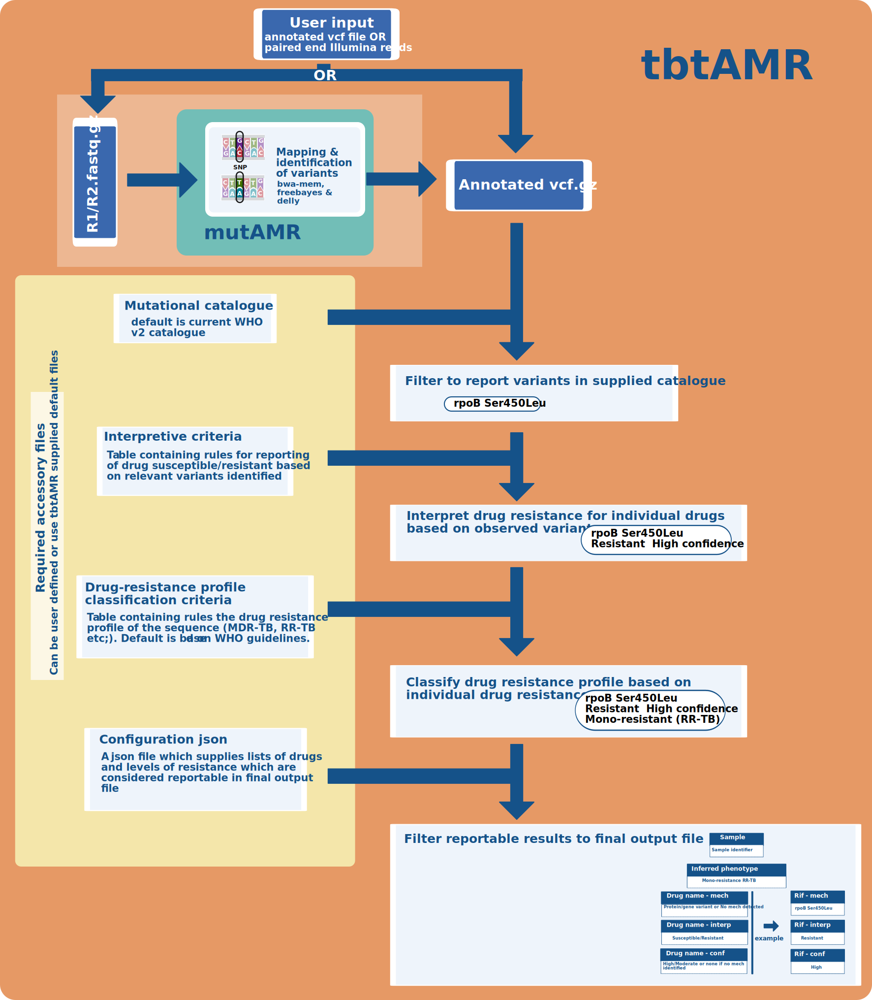

# tbtAMR documentation

Welcome to the home of tbtAMR the newest member of the tAMR family of tools - cousin of abritAMR

tbtAMR was developed to address the need for a data-driven and flexible solution to inferring DST for _M. tuberculosis_ in a clinical and public health laboratory.

tbtAMR is a very simple idea to meet a very specific question. That is generate genomic DST results that are suitable for reporting in a clinical setting. In order to facillitate this users are able to supply at a minimum a vcf file (annotated with snpEff) and either leverage a default mutational catalougue and criteria. Or provide their own catalogues and intepretative criteria in csv format. This means that there is no need for a developer to update logic or databases, which makes updates and therefore reverification much more straightforward and user-firendly in a CPHL setting. In addition, with additional dependencies, if required DST can also be reported from paired-end reads.

